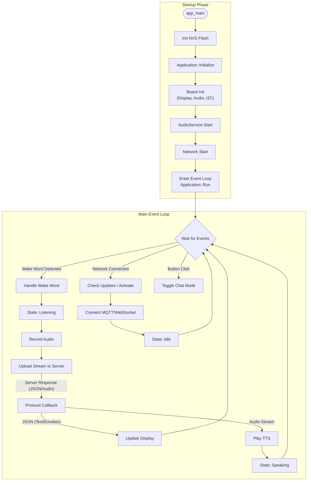

# Xiaozhi ESP32 Project Analysis

## 1. Directory Structure & Roles

The project follows a standard ESP-IDF component structure. Here is the breakdown of the key directories in `main/`:

| Directory | Description |
| :--- | :--- |
| **`main/`** | Root of the application code. Contains `main.cc` (entry point) and `application.cc` (main logic). |
| **`main/boards/`** | **Hardware Abstraction Layer**. Contains definitions for different ESP32 boards (pinouts, init code). Specific board logic (like `esp-box-3`) resides here. |
| **`main/display/`** | **UI & Display Logic**. Contains drivers for screens (OLED, LCD) and UI rendering logic (LVGL for menus, Custom Engine for "Face" animations). |
| **`main/audio/`** | **Audio Pipeline**. Handles microphone input (I2S), speaker output, wake word detection (`wake_word`), and codec management (`audio_codec`). |
| **`main/protocols/`** | **Network Communication**. Implements the transport layer for talking to the server. Supports `MQTT` and `WebSocket`. Handles sending audio/events and receiving JSON/Audio. |
| **`main/scripts/`** | Utility scripts, likely for building or flashing resources. |
| **`main/assets/`** | Static resources like images, fonts, and sound files (often converted to C arrays or binary partitions). |

## 2. Execution Flow & Logic

The system is event-driven, centered around the `Application` class.

### Startup Sequence (`app_main`)
1.  **NVS Flash Init**: Initializes non-volatile storage for WiFi credentials.
2.  **App Instance**: generic `Application::GetInstance()` singleton is created.
3.  **App Initialize**:
    *   Initializes the **Board** (Display, Audio Codec, I2C/SPI).
    *   Sets initial **Display** state (e.g., "Starting...").
    *   Starts **AudioService** (begin sensing microphone).
    *   Starts **Network** (WiFi/Cellular).
4.  **App Run**: Enters the main event loop (`Application::Run()`).

### Main Event Loop
The `Run()` loop blocks waiting for events (`xEventGroupWaitBits`). Key events include:

*   **Network Events**: When WiFi connects, it triggers **Activation** (OTA check, Login) and then **Protocol Connection**.
*   **Wake Word**: When `AudioService` detects "Xiaozhi", it triggers `MAIN_EVENT_WAKE_WORD_DETECTED`.
*   **Audio Data**: Voice data is continually popped from the queue and sent to the server via the active protocol.
*   **Incoming Data**: The Protocol receives JSON (commands) or Audio (TTS).
    *   **JSON**: Parsed to update the screen (Emoji, Text) or control state (Stop Listening).
    *   **Audio**: Pushed to the speaker for playback.

### State Machine
The device operates in several states (`DeviceState`):
*   `Idle`: Waiting for wake word.
*   `Listening`: Recording user voice and uploading.
*   `Speaking`: Playing back TTS response.
*   `WifiConfiguring`: Initial setup mode.

## 3. Execution Flowchart

## 4. Key Logic Files
*   **`main/application.cc`**: The "Brain". Handles the state machine and routes events.
*   **`main/protocols/mqtt_protocol.cc`**: The "Mouth & Ears". Handles data exchange with the cloud.
*   **`main/display/emote_display.cc`**: The "Face". Updates expressions based on state.
*   **`main/audio/audio_service.cc`**: The "Senses". Manages mic reading and speaker writing.

## 5. System Architecture & FreeRTOS Concurrency

The system relies heavily on **FreeRTOS** for multitasking, with a clear separation of concerns between Audio IO, Processing, and Main Logic.

### Task Hierarchy

| Task Name | Priority | Core Config | Stack Size | Role |
| :--- | :--- | :--- | :--- | :--- |
| **`main`** (Application::Run) | Default | Default (0) | Default | **Central Orchestrator**. Handles the Event Loop, UI updates, and State Machine transitions. Blocks on `xEventGroupWaitBits`. |
| **`audio_input`** | **8 (High)** | **Core 0** | 6 KB | **Critical Real-time**. Reads I2S from microphone, feeds Wake Word engine & Audio Processor. Pinned to Core 0 to ensure low latency. |
| **`audio_output`** | 4 (Med) | Any | 4 KB | Pops PCM data from playback queue and writes to I2S/Speaker. |
| **`opus_codec`** | 2 (Low) | Any | 26 KB | **Heavy Computation**. Handles Opus Encoding (Mic -> Network) and Decoding (Network -> Speaker). Low priority prevents it from starving real-time audio IO. |
| **`activation`** | 2 (Low) | Any | 8 KB | Ephemeral task spawned on network connect to check OTA and perform login. |

### CPU Core Usage
*   **Core 0 (PRO_CPU)**: Explicitly handles **Audio Input** (Signal Processing/Wake Word). This is computationally intensive and latency-sensitive.
*   **Core 1 (APP_CPU)**: Typically handles the **Main Application Loop**, **WiFi/Networking** (Protocol), and **UI Rendering**.

### Inter-Task Communication
1.  **Event Groups (`xEventGroup`)**: The primary signaling mechanism.
    *   `Application::event_group_`: Signals state changes, network events, wake words.
    *   `AudioService::event_group_`: Signals audio hardware state (Starting/Stopping).
2.  **C++ Queues + Mutex/CV**: Used for data transport instead of raw FreeRTOS queues.
    *   `audio_encode_queue_`: Raw PCM waiting for Opus encoding.
    *   `audio_send_queue_`: Encoded packets waiting for Network upload.
    *   `audio_decode_queue_`: Incoming Network packets waiting for Opus decoding.
    *   `audio_playback_queue_`: Decoded PCM waiting for Speaker output.

### Scheduling Logic
The system uses a **Producer-Consumer** model:
1.  **Producer (`audio_input`)**: High priority. Captures audio -> Pushes to `audio_encode_queue_`.
2.  **Processor (`opus_codec`)**: Low priority. Wakes up when queue has data -> Encodes -> Pushes to `audio_send_queue_`.
3.  **Consumer (`network`)**: Runs in Main loop. Checks `audio_send_queue_` -> Uploads.

This architecture ensures that **Audio Capture** never stutters, even if the Network or Codec falls behind.
