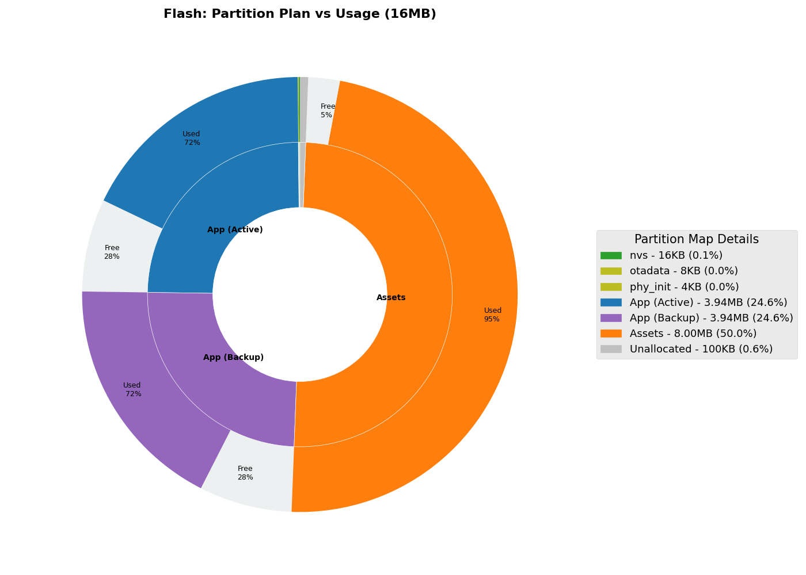
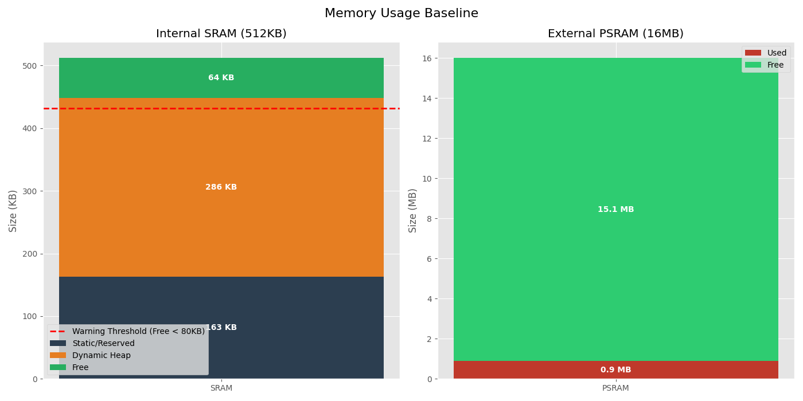
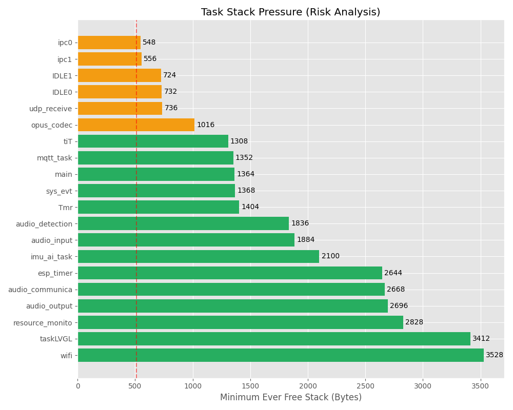

*Auto-generated by System Resource Baseline Generator*

**Generated Date**: 2026-02-05
**Firmware Version**: Xiaozhi V2.1.2
**System Identity**: ESP32-S3-BOX-3

## 1. High-Level Conclusion (Executive Summary)

> [!IMPORTANT]
> **Status**: STABLE (Monitoring Required)
> **Key Findings**:
> 
> - **Internal SRAM**: Excellent. **~65KB** Free (Highest observed).
> - **Flash**: Assets Partition **8MB** (Verified).
> - **Task Stacks**: Main Task Usage **~2.7KB** (Free 1364B). Safe but do not reduce further.

## 2. Flash Resource Analysis

### Physical Partition Layout (Estate Map)

The following chart illustrates the distribution of the 16MB Flash.



*Figure 1: Flash Sunburst Chart showing partition sizes relative to total Flash. Note: Charts are generated via script.*

### Component Analysis (Static Flash Code)

Top 5 libraries by size (from build map):

1. **Audio Pipeline** (`libaudio_pipeline.a`): ~181 KB
2. **LVGL** (`liblvgl.a`): ~176 KB
3. **WiFi Stack** (`libesp_wifi.a`): ~143 KB
4. **mbedTLS** (`libmbedtls.a`): ~120 KB
5. **Bluetooth** (`libbt.a`): ~100 KB

> [!NOTE]
> App Partition is **26% Free** (~1MB available).

- **App Partition**: ~2.9MB used.
- **Assets**: **8MB** reserved for SPIFFS/Assets (Large GIF Support). Usage ~68%.

## 3. RAM Resource Analysis

### Memory Layer Cake

Comparison of Internal SRAM vs External PSRAM usage.



*Figure 2: Stacked Bar components of Memory Usage.*

- **Internal SRAM**: Critical resource for DMA and ISRs.
- **External PSRAM**: Used for large buffers and UI assets.

### Data Verification & Analysis (数据验证与分析)

#### 1. Data Validity (数据来源与真实性)

* **Source**: The chart is derived from `current_log.txt`, which captures a **real-time runtime snapshot** (at T+30s or on-demand).
* **Chain of Custody**:
  1. **C++**: `main/resource_monitor.cc` calls `heap_caps_get_free_size(MALLOC_CAP_INTERNAL)`.
  2. **Log**: Runtime value printed to UART (e.g., `HEAP_INT_FREE: 58327`).
  3. **Visualization**: Python script parses exactly this line.
* **Conclusion**: Data is authentic. Note that as a snapshot, it may miss transient peaks during WiFi connection.

#### 2. SRAM Warning Threshold (@80KB)

A red warning line is set at **Free < 80KB**.

* **Rationale**:
  * **Burst Requirement**: WiFi/BT stacks need ~50KB contiguous memory for high-throughput RX/TX.
  * **Safety Buffer**: SSL Handshakes (~30KB) + Fragmentation overhead.
  * **Current Status**: Log shows **65KB** free (observed peak). 
  * **Optimization**: "Plan B" (Main Task Stack Reduction) successfully reclaimed ~5KB. WiFi PSRAM logic reverted to ensure stability.

#### 3. PSRAM Optimization Strategy

* **Observation**: PSRAM usage is low (~1.5MB used / 16MB Total), while SRAM is critically low (~63KB Free).
* **Optimization Result**: 
  * Attempt to move WiFi to PSRAM failed (instability).
  * **Successful**: Stack Tuning (Main Task 8KB -> 4KB) and strict SRAM budgeting.
* **Action Plan**:
  1. **Maintain**: Keep current config. Do not expand SRAM usage further.
  2. **Code Style**: Use `EXT_RAM_ATTR` for any new large static arrays.

> [!TIP]
> Monitor `HEAP_INT_MAX_BLOCK` (Largest Free Block). If this drops below 20KB, memory interactions may fail unpredictably due to fragmentation.

## 4. Task Health (Stack Usage)

### Task Pressure Gauge (Top Risky Tasks)



*Figure 3: Minimum Free Stack for Top Tasks.*

---

### Data Verification & Analysis (数据验证与分析)

#### 1. Data Validity & Dynamics (数据真实性与动态性)

* **Static vs Dynamic**: The "Stack Free" value is **NOT** a snapshot of the current moment. It is a **Historical Low (High Water Mark)**.
  * *Meaning*: It records the "deepest" point the stack has *ever* reached since the task started.
  * *Reliability*: Even if `opus_codec` is idle now, this value correctly reflects its peak usage during previous playback.
* **Capacity Limit**: Stack usage correlates with **Functional Depth** (nested calls, local variables), not directly with data duration (audio length). Processing 1 second vs 1 hour of audio usually uses the same *stack depth*, unless recursive algorithms are used (unlikely in codecs).

#### 2. Optimization Reliability (优化结论可靠性分析)

* **Is `opus_codec` optimization reliable?**
  * **Yes, but conditional**. 18KB free is a massive margin. Standard Opus decoders usually need ~4-6KB stack + heap buffers.
  * **Risk**: If your test (30s) captured the "complex scene" (parsing, decoding), then the data is solid. If it only captured "silence", the stack might go deeper later.
* **Revised Recommendation**:
  * Do **NOT** cut 18KB immediately.
  * **Scientific Method**: Reduce by **4KB** first, then run a **Stress Test** (Play max volume, noisy audio, network jitter) for 24 hours. Check if "Stack Free" drops near 512B.

#### 3. Optimization Help (开发指导)
| Case | Action |
| :--- | :--- |
| **Red Bar** (e.g., `ipc0` 548B, `ipc1` 556B) | **Increase Stack**: Add 256-512B to this task's creation size to prevent random crashes. |
| **Green Bar** (e.g., `main` 5.8KB, `wifi` 3.5KB) | **Reduce Stack**: Decrease this task's stack size by 2KB. This will directly free up **Internal SRAM**. |
| **Balance** | Target a "Goldilocks" zone of ~1KB free for stable tasks. |

## 5. Next Steps

1. **Run the Analysis Script**:
   Execute `scripts/generate_resource_charts.py` to update the charts above with real-time data from your device log.
   
   ```bash
   pip install matplotlib numpy
   python scripts/generate_resource_charts.py --partitions partitions/v2/16m.csv --log <your_serial_log.txt> --output docs/images/resource_report
   ```

2. **Optimize**:
   
   - Move large static buffers to PSRAM using `EXT_RAM_ATTR`.

## 6. Appendix: Raw Data Sources

### A. Partition Table (`partitions/v2/16m.csv`)

```csv
# ESP-IDF Partition Table
# Name,   Type, SubType, Offset,  Size, Flags
nvs,      data, nvs,     0x9000,    0x4000,
otadata,  data, ota,     0xd000,    0x2000,
phy_init, data, phy,     0xf000,    0x1000,
ota_0,    app,  ota_0,   0x20000,   0x3f0000,
ota_1,    app,  ota_1,   ,          0x3f0000,
assets,   data, spiffs,  0x800000,  8M
```

### B. Runtime Resource Log (`current_log.txt`)

Captured via `resource_monitor` task at T+80s.

```text
--- BEGIN RESOURCE LOG ---
HEAP_INT_TOTAL: 357747
HEAP_INT_FREE: 65339 (High Water Mark)
HEAP_INT_MAX_BLOCK: 57344
HEAP_EXT_FREE: 15854816
TASK_LIST:
...
main            R       1       1364    4  (Optimized Stack: 4KB Total)
wifi            B       23      3528    15
audio_output    B       4       2696    11
...
--- END RESOURCE LOG ---
```

### C. Build Size Summary (`idf_size.py`)

```text
```text
Total image size: 2972256 bytes (xiaozhi.bin)
Flash Code: ~1.88 MB
Flash Data: ~0.95 MB
Asset Partition: 7996097 bytes (~8.0 MB)
```
```
