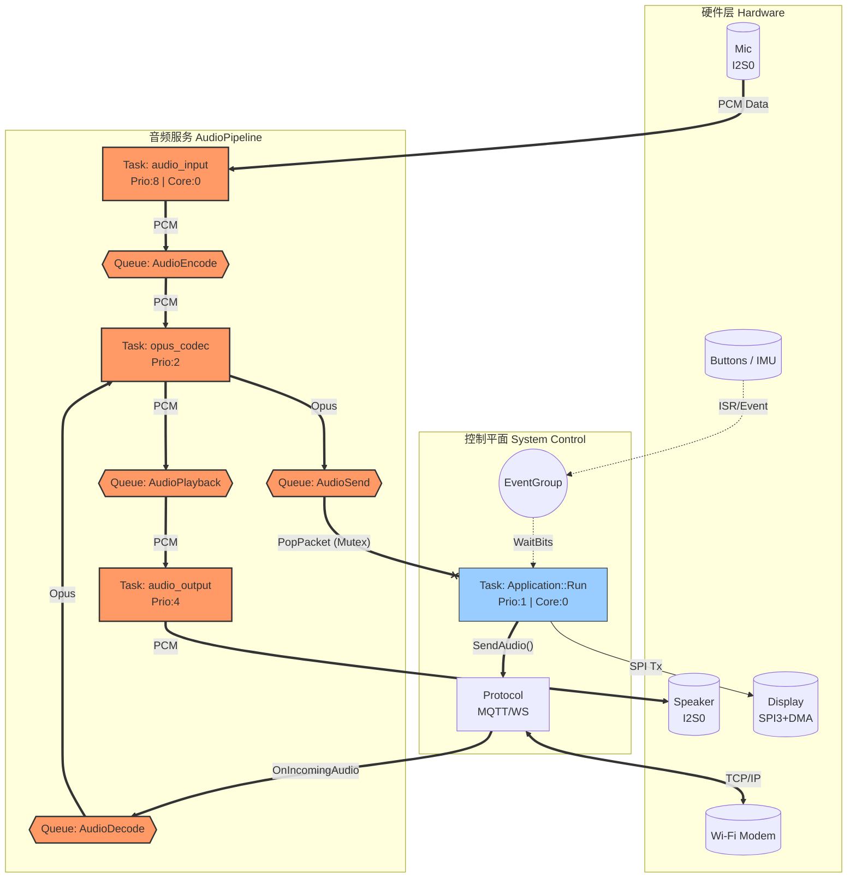

# Xiaozhi-ESP32 软件架构深度扫描报告

我是嵌入式系统架构师。基于对项目源码的深度静态分析（Deep Traversal），我已经完成了对 Xiaozhi-ESP32 项目的“城市交通规划”测绘。

以下是完整的架构拓扑映射与风险评估报告。

## 1. 实体提取与索引 (Entity Extraction & Indexing)

经过对 `.c/.cpp` 及头文件的地毯式扫描，核心实体索引如下：

### 1.1 任务 (Tasks - The Traffic Generators)
系统采用 **"采集-处理-分发"** 的流水线架构。

| 任务名称 (Task Name) | 优先级 (Prio) | 堆栈 (Stack) | 核心 (Core) | 职责 (Responsibility) | 源码位置 |
| :--- | :--- | :--- | :--- | :--- | :--- |
| **audio_input** | **8 (High)** | 6KB | **Core 0** | **[源头]** 从 I2S 读取 PCM，极高实时性，驱动整个流水线。 | `audio_service.cc` |
| **audio_output** | 4 | 2KB / 4KB | Any | **[终点]** 从播放队列取 PCM 写入 I2S DMA。 | `audio_service.cc` |
| **opus_codec** | 2 | 26KB | Any | **[加工厂]** 负责 Opus 编码 (Tx) 与解码 (Rx)。CPU 密集型。 | `audio_service.cc` |
| **Application** | 1 (Low) | 0 (Default) | Core 0 | **[枢纽]** 主循环。负责网络 I/O (SendAudio)、UI 更新、事件分发。 | `application.cc` |
| *activation* | 2 | 8KB | Any | (临时任务) 负责 OTA 检查和设备激活。 | `application.cc` |

### 1.2 通信与同步 (IPC - The Roads & Signals)
本项目未使用原始的 FreeRTOS Queue 传输大数据块，而是采用了 **C++ `std::deque` + `std::mutex`** 的组合模式，这是一条特殊的“高速公路”。

*   **数据管道 (Data Pipelines)**:
    *   `audio_encode_queue_`: Mic PCM -> Encoder
    *   `audio_send_queue_`: Opus Packet -> Network
    *   `audio_decode_queue_`: Network -> Decoder
    *   `audio_playback_queue_`: Decoded PCM -> Speaker
    *   **机制**: `std::unique_lock<std::mutex>` + `std::condition_variable`。

*   **信号系统 (Signals)**:
    *   `event_group_`: 核心红绿灯。控制系统状态 (`MAIN_EVENT_SEND_AUDIO`, `MAIN_EVENT_NETWORK_CONNECTED`)，连接 ISR 与主任务。

### 1.3 硬件驱动绑定 (Driver Bindings)
*   **Audio (I2S0)**: MCLK(02), BCLK(17), WS(45), DIN(16), DOUT(15). 
*   **Display (SPI3)**: MOSI(06), SCLK(07), DC(04), CS(05), RST(48). **使用了 DMA (`SPI_DMA_CH_AUTO`)**。
*   **Control (I2C1)**: SDA(08), SCL(18). 挂载 ES8311, ES7210, ICM-42670P(Addr 0x68).
*   **Input**: Boot Button(0), Mute(1).

## 2. 流量与带宽分析 (Traffic Analaysis)

*   **高速公路 (High Bandwidth/Critical)**:
    *   **路径**: Mic -> `audio_input` -> `opus_codec` -> `Application` -> Network
    *   **特征**: 16kHz/24kHz 采样，帧长 60ms。任何环节的阻塞都会导致爆音或断连。
    *   **高危点**: 音频发送逻辑位于 `Application::Run` 循环中，与 UI 刷新共享线程。

*   **市政道路 (Control Plane)**:
    *   **路径**: Buttons/IMU -> `event_group_` -> `Application` -> Display
    *   **特征**: 突发事件，数据量小，但要求响应及时的 UI 反馈。

## 3. 可视化拓扑 (Architecture Topology)

以下是基于 mermaid 绘制的软件架构拓扑图：

## 4. 架构风险预警 (Architectural Risk Assessment)

### 🚨 风险 1: 优先级倒置与网络瓶颈 (Critical)
*   **现象**: 音频发送 (`SendAudio`) 逻辑位于 `Application` 主任务中，而该任务优先级为 **1 (最低)**。
*   **后果**: 
    1.  `OpusCodec` (Prio 2) 生产数据的速度如果快于 `Application` 处理的速度（例如 `Application` 正在刷新屏幕或处理复杂 JSON），`AudioSendQueue` 会迅速积压。
    2.  在高负载下，网络吞吐量受限于主循环的迭代速度，而非网络带宽。
*   **建议**: 将网络发送逻辑移至一个独立的、优先级高于 Codec 的 `NetworkTask` 中。

### ⚠️ 风险 2: 锁粒度过大 (Medium)
*   **现象**: `AudioService` 使用一把大锁 `audio_queue_mutex_` 保护所有队列。
*   **后果**: `AudioInputTask` (Core 0, Prio 8) 是极高频任务。如果低优先级的 `MainTask` (Prio 1) 在持有锁时被抢占（Preemption），高优先级的音频输入任务将发生 **优先级翻转 (Priority Inversion)**，导致录音丢帧。

### ⚠️ 风险 3: 内存与 DMA 竞争 (Low)
*   **现象**: Display 使用 DMA 传输全屏数据 (320x240x16bit = 150KB/帧)。
*   **后果**: 虽然 ESP32-S3 有足够的 DMA 通道，但频繁的屏幕刷新会占用大量总线带宽，可能会干扰 I2S 的 DMA 请求，尤其是在 SPI 频率配置过高时。建议确保 `config.h` 中 SPI 频率不超过 40MHz (Box-3 屏幕通常支持到 40-60MHz)。
