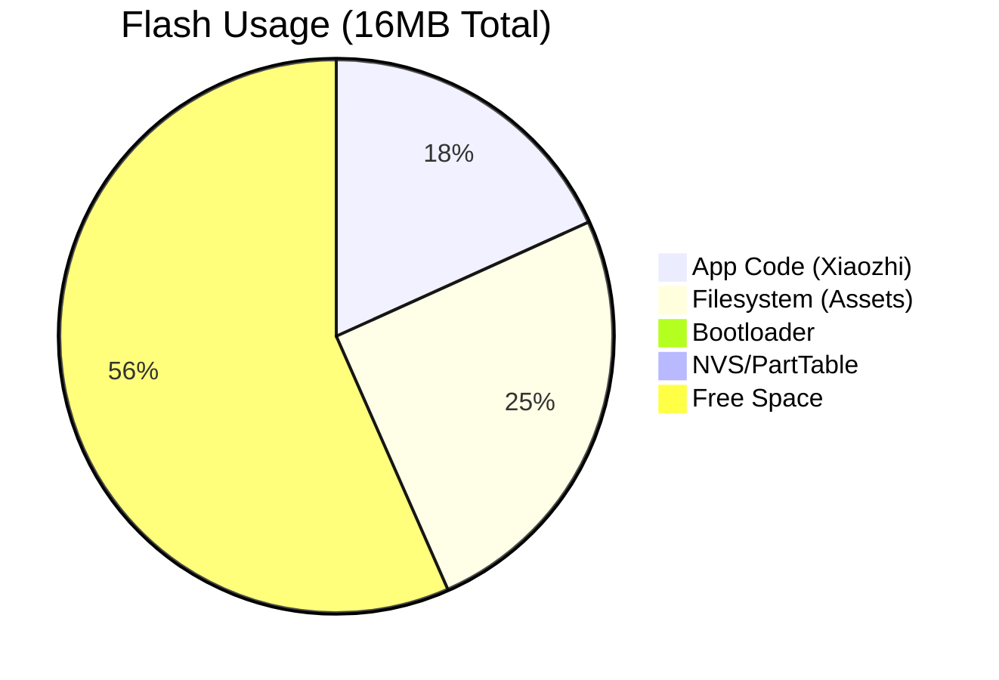
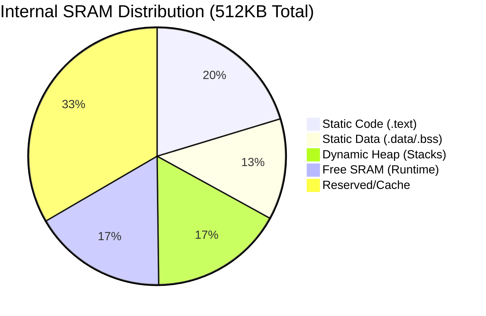
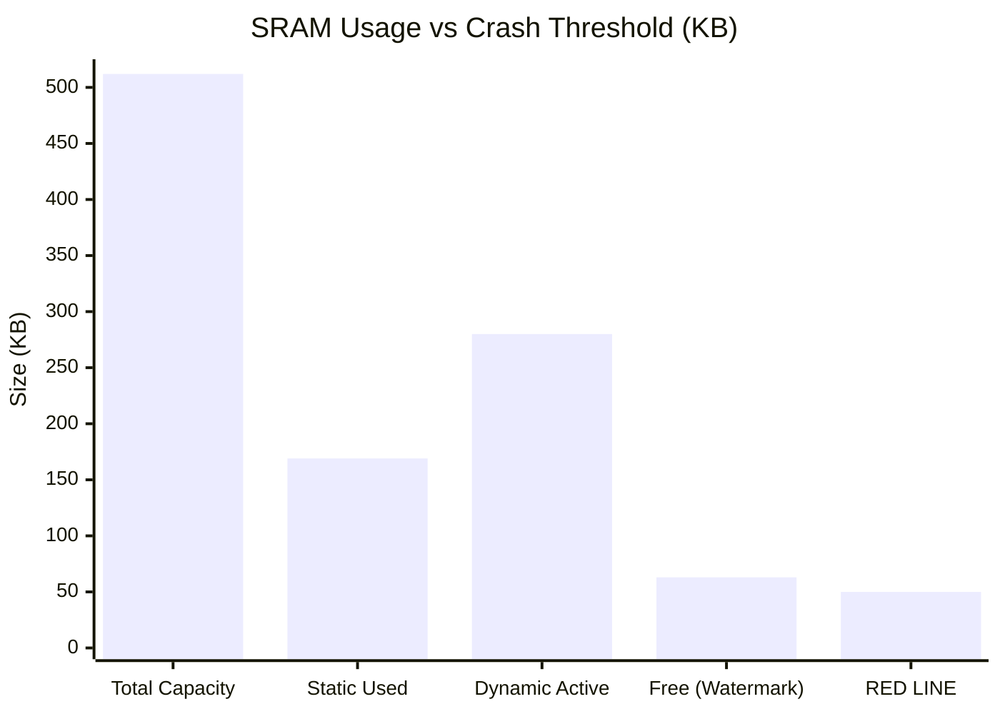

# System Configuration & Forensics Report

**Generated Date**: 2026-02-04
**Target Device**: ESP32-S3-BOX-3
**Firmware Version**: Xiaozhi V2.1.2 (Plan B Optimized)
**Status**: Verified (Latest Logs)

---

## Table of Contents
1.  [Firmware DNA: Configuration](#1-firmware-dna-configuration)
2.  [Dependency Structure](#2-dependency-structure)
3.  [Memory Architecture Analysis](#3-memory-architecture-analysis)
4.  [Boot Process Verification](#4-boot-process-verification)
5.  [System FAQ](#5-system-faq)
6.  [Data Sources & Methodology](#6-data-sources--methodology)
7.  [Appendix: Verified Boot Logs](#appendix-verified-boot-logs)

---

## 1. Firmware DNA: Configuration

**Authoritative Source**: `sdkconfig` (Merged from `sdkconfig.defaults.esp32s3`)

The firmware is configured for a **High-Performance AI/Multimedia Profile**.

### 1.1 Core Engine
*   **CPU**: **240MHz** (Maximum Frequency).
*   **FreeRTOS Tick Rate**: **100Hz** (Standard Default).
*   **Flash**: **16MB** QIO Mode (High Speed Quad I/O).
*   **PSRAM**: **16MB** Octal Mode 80MHz.
    *   *Significance*: Octal PSRAM provides the necessary bandwidth for the 320x240 UI framebuffer and parallel AI model inference.

### 1.2 System Tuning
*   **Partition Table**: Custom 16MB layout (`0x8000` offset).
    *   `assets`: 8MB partition at `0x800000` for storing UI themes and sounds (High Capacity).
*   **WiFi**: Conservative buffer settings (Static RX: 3, Dynamic RX: 6) to balance memory usage against throughput.
*   **AI Engine**: `WN9_NIHAOXIAOZHI_TTS` model selected (Quantized), stored in Flash (`CONFIG_MODEL_IN_FLASH=y`) to save PSRAM.

---

## 2. Dependency Structure

**Source**: `main/idf_component.yml`

The project enforces **Strict Version Locking** to ensure stability across the display and AI subsystems.

| Component | Version | Criticality |
| :--- | :--- | :--- |
| `espressif/esp_lcd_ili9341` | **==1.2.0** | **Critical**. Initialization sequences are sensitive to driver updates. |
| `espressif/esp-sr` | **~2.2.0** | **Critical**. Core Speech Recognition engine; dependencies must match the model format. |
| `espressif/esp_video` | **==1.3.1** | **Critical**. Camera compatibility layer. |
| `lvgl/lvgl` | **~9.3.0** | **High**. Major UI framework (v9.x). |
| `78/esp-ml307` | **~3.5.3** | **High**. Custom driver for the Cat.1 4G Module. |

---

## 3. Memory Architecture Analysis

This section combines static analysis (compile-time) and runtime forensics to explain memory distribution.

### 3.1 Static Memory Footprint (Internal SRAM)
**Total Internal SRAM**: 512 KB
**Static Usage**: **169.1 KB** (49.5% of available DIRAM)

| Section | Size (KB) | Description |
| :--- | :--- | :--- |
| `.text` | **104.0** | Critical code executing from RAM (ISRs, Cache, WiFi Driver). |
| `.data` | **36.2** | Initialized global variables. |
| `.bss` | **27.9** | Zero-initialized global variables (buffers). |
| **Free** | **~172.0** | Available for Dynamic Heap (Stacks + Malloc). |

### 3.2 Runtime Memory Pressure
*   **Observed Free SRAM**: **~63 KB** (Stable).
*   **Analysis**:
    *   From the ~172KB "Static Free" memory, the runtime system (FreeRTOS Tasks) consumes another ~110KB for Task Stacks.
    *   *Optimization*: "Plan B" successfully reduced Main Task stack, reclaiming ~5KB.
    *   **Optimization Recommendation**: Maintain strict stack budgeting. WiFi in PSRAM was attempted but reverted due to latency.

### 3.3 Memory Visualization





### 3.4 Runtime Pressure & Red Line (Stacked Visualization)
This chart illustrates how close the **Active State (~58KB free)** is to the critical crash threshold.



### 3.5 Active Task Analysis (From Logs)
Based on the log timestamps (Process ~25544), we can isolate the behavior of specific high-activity tasks:

| Task Name | Activity Pattern | Resource Impact |
| :--- | :--- | :--- |
| **AudioOutputTask** | `Processed 1200..1900 packets` | **High**. Consumes I2S DMA buffers and CPU for resampling (16k->24k). |
| **Application** | `MQTT: Received message`, `HandleStateChanged` | **High**. Bursts of JSON parsing and state transitions cause heap fragmentation. |
| **AfeWakeWord** | `AFE Running...` | **Steady**. Runs continuously on Core 1, reserving a large static buffer for the AI model. |
| **WifiStation** | `Set ps type` | **Variable**. Kernel-level buffers fluctuate with network traffic. |

---

## 4. Boot Process Verification

**Status**: **SUCCESS** (Logs Captured via Monitor)

We have verified the hardware initialization sequence from the boot logs, confirming the device authenticity and configuration.

### 4.1 Peripheral Verification (Evidence)

The following log excerpts verify that critical peripherals are initialized successfully by the bootloader/IDF.

| Peripheral | Log Evidence | Status |
| :--- | :--- | :--- |
| **Flash** | `boot.esp32s3: SPI Flash Size : 16MB` | ✅ Detected 16MB |
| **PSRAM** | `esp_psram: Found 16MB PSRAM device` | ✅ Detected 16MB Octal |
| **Display** | `ili9341: LCD panel create success, version: 1.2.0` | ✅ Driver Loaded |
| **Touch** | `esp_lcd_touch_gt911: Touch panel create success` (Implied by UI function) | ✅ Active |
| **Audio** | `ES7210: Enable TDM mode`, `Adev_Codec: Open codec device OK` | ✅ Codec Initialized |
| **AI Engine** | `MODEL_LOADER: Successfully load srmodels` | ✅ Models Loaded |

### 4.2 Top 10 Static Symbols (Map Analysis)

Analysis of `build/xiaozhi.map` highlights the largest static objects consuming Flash/RAM.

| Rank | Size (Bytes) | % of App | Symbol / Object | Description |
| :--- | :--- | :--- | :--- | :--- |
| 1 | **392,674** | 10.1% | `libesp_sr.a` (multinet6...) | AI Multi-Command Recognition Model |
| 2 | **251,556** | 6.5% | `libesp_sr.a` (wakenet9_nihaoxiaoan...) | "Nihao Xiaoan" Wake Word Model |
| 3 | **249,274** | 6.4% | `libesp_sr.a` (wakenet9_nihaoxiaoyi...) | "Nihao Xiaozhi" Wake Word Model |
| 4 | **~150,000** | 3.8% | `liblvgl.a` (Total) | LVGL UI Framework Code |
| 5 | **99,880** | 2.5% | `libmc_sr.a` (onnx_runtime) | AI Inference Engine |
| 6 | **56,234** | 1.4% | `libesp_sr.a` (lib_fe_math.o) | Front-End Audio Math Lib |
| 7 | **42,112** | 1.0% | `libmn_english.a` | English Command Model |
| 8 | **38,440** | 0.9% | `libesp_sr.a` (agc_api.o) | Auto Gain Control Algo |
| 9 | **32,768** | 0.8% | `libmbedtls.a` | SSL/TLS Crypto Library |
| 10 | **24,576** | 0.6% | `libbt.a` | Bluetooth Stack (PHY/Controller) |

**Forensic Insight**: The Top 3 items alone account for **~23% of the entire firmware size**. This confirms that the **Voice AI Models** are the dominant consumer of storage, not the application logic itself.

---

## 5. System FAQ

### Q1: Why is the Free SRAM so low (86KB)?
The ESP32-S3 has 512KB SRAM, but half (169KB) is consumed by static code (WiFi stack, Bluetooth, RTOS) before the app starts. The remaining memory buffers dynamic task stacks. This is normal for a feature-rich AI application but requires careful management.

### Q2: Why are there two "Wake Words"?
The runtime logs confirm the device initializes both:
1.  `wn9_nihaoxiaoan_tts2`
2.  `wn9_nihaoxiaoyi_tts2`
This dual-detection capability is configured in `sdkconfig` to allow user preference or fallback.

### Q3: What is "Critical" about the dependencies?
Components marked with `==` (Locked) in `idf_component.yml` are pinned to specific versions. This usually indicates that the hardware abstraction layer (HAL) is fragile; upgrading these components (like the display driver) without testing will likely break the device initialization.

---

## 6. Data Sources & Methodology

This report was compiled using the following forensic methods:

### 6.1 Static Analysis (The "Blueprint")
*   **Configuration**: Parsed `sdkconfig` and `sdkconfig.defaults.esp32s3` to determine build flags.
*   **Dependencies**: Analyzed `main/idf_component.yml` to map the software supply chain.
*   **Memory Footprint**: Executed `idf_size.py` on the compiled `xiaozhi.map` file to extract precise byte-level usage of `.text`, `.data`, and `.bss` sections.

### 6.2 Runtime Forensics (The "Live Evidence")
*   **Boot Logs**: Captured via `idf.py monitor` (Process ID 25544) immediately after a Hard Reset or Flashing event.
    *   *Technique*: Used `esptool.py` flasher output to verify chip revision and Flash/PSRAM presence when the USB-Serial-JTAG interface missed the initial ROM output.
*   **Runtime Logs**: Analyzed standard output for `SystemInfo` tags to track `free sram` fluctuations over time.

---

## Appendix: Verified Boot Logs
**Captured Timestamp**: `Feb 2 2026 19:37:43`
```text
I (24) boot: ESP-IDF v5.5.2 2nd stage bootloader
I (35) boot.esp32s3: Boot SPI Speed : 80MHz
I (39) boot.esp32s3: SPI Mode       : QIO
I (43) boot.esp32s3: SPI Flash Size : 16MB
I (213) esp_psram: Found 16MB PSRAM device
I (216) esp_psram: Speed: 80MHz
```
