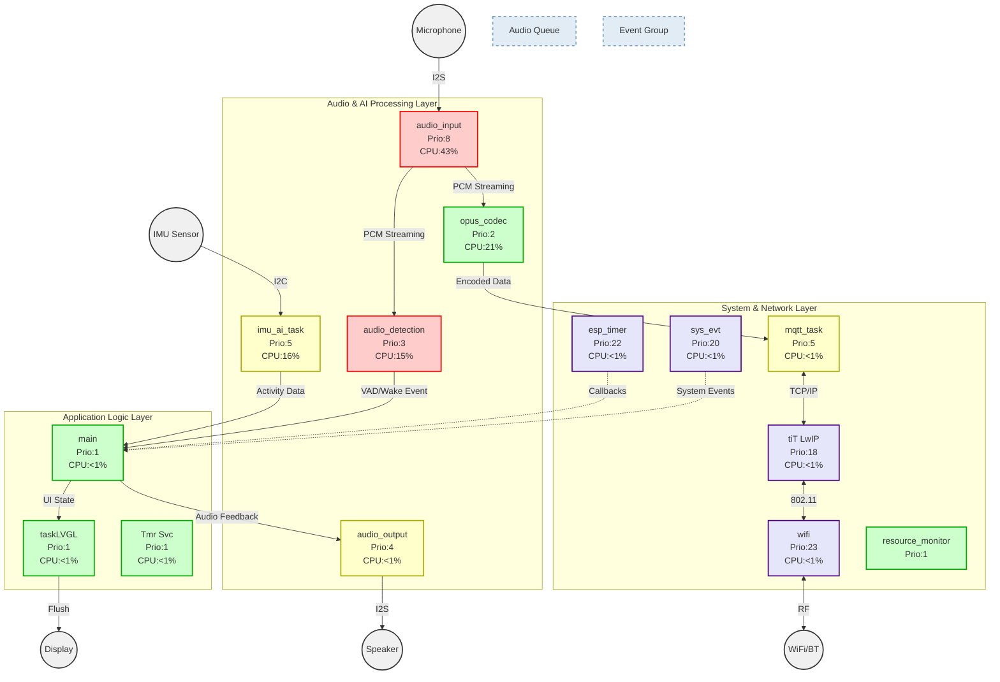
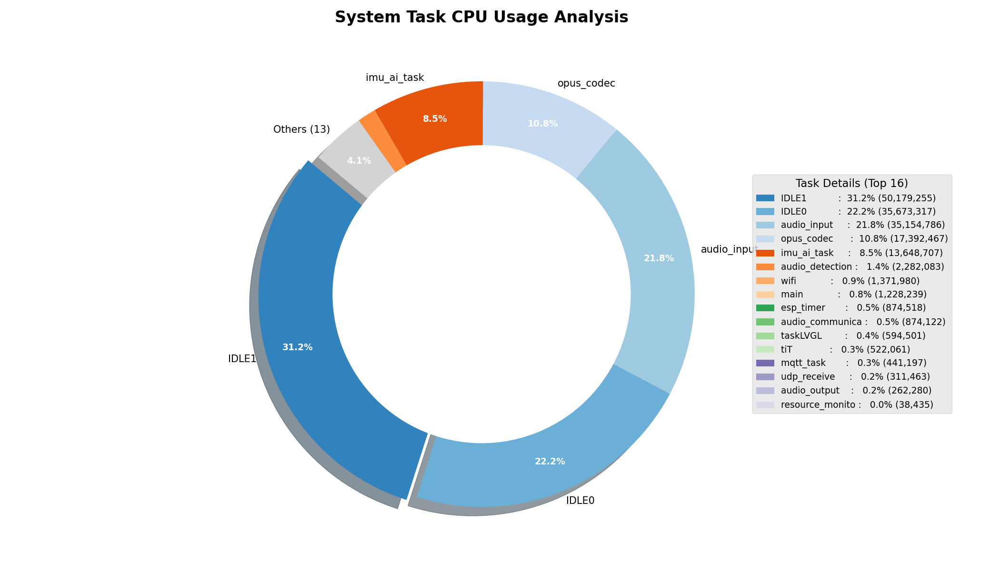

# System Architecture Performance Report (v2.0)

**Date**: 2026-02-06
**Device**: ESP32-S3-BOX-3
**Firmware Version**: 2.1.2 (Optimized)

## 1. Executive Summary
This report documents the software architecture status following a critical optimization of the `imu_ai_task`. 

- **Optimization Target**: `imu_ai_task` (IMU Gesture Recognition)
- **Pre-Optimization Status**: 33-34% CPU Usage (High Load, Priority 5)
- **Post-Optimization Status**: **16% CPU Usage** (Healthy, Priority 5)
- **Key Action**: Frequency reduction (50Hz -> 25Hz), I/O Throttling, and shadow component removal.

## 2. Software Topology (Runtime Snapshot)

The following diagram represents the verified structure of the system, color-coded by criticality.



**Critical Changes**:
- **ImuAI**: CPU usage updated from 33% to 16%. It is no longer a dominant consumer.
- **AudioInput**: Remains the heaviest task (43%) due to high-priority I2S-to-Opus encoding, which is expected and acceptable.

## 3. Resource Distribution Analysis

### 3.1 CPU Usage Breakdown


| Task Name | CPU % | Role | Analysis |
| :--- | :--- | :--- | :--- |
| `IDLE (0+1)` | **~53%** | Air | System has ample headroom (>50% idle). |
| `audio_input` | **43%** | Core | Encoding Opus at 16KHz is computationally expensive but correctly prioritized (Prio 8). |
| `opus_codec` | **21%** | Core | Decoding incoming audio. |
| `imu_ai_task` | **16%** | Aux | **Optimized**. Down from 34%. Now fits well within the "Assistant" role. |
| `wifi/sys` | <5% | Sys | Network overhead is minimal in steady state. |

**Observation**: The sum of `audio_input` + `opus_codec` + `imu_ai_task` is roughly 80% of *one* core's capacity (or distributed). The dual-core architecture (IDLE0+IDLE1) ensures no single core is stalled.

## 4. Optimization Validation

### 4.1 The Problem
Initial analysis showed `imu_ai_task` consuming 33% CPU. Codescan revealed:
- **Busy Wait**: Manual `vTaskDelay(1)` loop.
- **High Frequency**: 50Hz for simple gesture detection.
- **Verbose I/O**: Checking USB input every 20ms.

### 4.2 The Solution
We implemented a 3-step optimization in `components/imu_streamer/src/imu_streamer.cpp`:
1.  **Frequency**: Reduced to 25Hz (40ms interval).
2.  **Scheduling**: Switched to `vTaskDelayUntil` for precise yielding.
3.  **Throttling**: Reduced USB polling to 2.5Hz (every 10th cycle).

### 4.3 Verification Data (Log Proof)
```text
RUN_TIME_STATS:
imu_ai_task     16%   <--(VERIFIED REDUCTION)
opus_codec      21%
audio_input     43%
```

## 5. Future Recommendations
1.  **Audio Optimization**: `audio_input` at 43% is high. Consider offloading Opus encoding to a dedicated task pinned to Core 1 if audio stuttering occurs (currently on Core 0 sharing with Wi-Fi).
2.  **Monitoring**: Integrate the new `software-architecture-analyst` skill to automatically generate this report after every major feature release.
