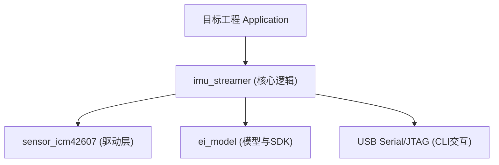

# TinyML Module 集成指南

本文档旨在指导如何将本工程中的 **手势识别模块 (IMU Streamer)** 移植到其他 ESP-IDF 项目中。

## 1. 核心结论 (Executive Summary)

*   **移植难度**: 中等 (涉及 3 个核心组件 + 硬件驱动)。
*   **关键依赖**: `components/modules/imu_streamer`, `components/drivers/sensor_icm42607`, `edge_impulse_sdk`。
*   **建议方案**:
    1.  **物理拷贝**: 将相关组件文件夹复制到目标工程的 `components/` 目录。
    2.  **解耦数据消费**: 建议改造 `imu_streamer`，从“打印日志”改为“发送 ESP Event 事件”，以便主程序响应。
    3.  **配置 USB**: 目标工程需正确配置 USB Serial/JTAG 避免 CLI 冲突。

---

## 2. 组件依赖拓扑

你不需要移植整个工程，只需关注以下组件：



### 文件清单
请将以下目录完整复制到新工程的 `components/` 下：
1.  `components/modules/imu_streamer`: 包含状态机、CLI 解析、主循环。
2.  `components/drivers/sensor_icm42607`: 包含 ICM-42607 寄存器操作与 I2C 读写。
3.  `components/edge_impulse` (或 `ei_model`): 包含训练好的 TFLite 模型文件。

---

## 3. 基础集成步骤

### Step 1: 复制与构建
复制上述三个文件夹后，在目标工程的 `main/CMakeLists.txt` 中添加依赖：

```cmake
idf_component_register(SRCS "main.c"
                       INCLUDE_DIRS "."
                       REQUIRES "imu_streamer" "sensor_icm42607")
```

### Step 2: 启动任务
在 `app_main()` 中创建一个独立的 FreeRTOS 任务来运行 Streamer：

```cpp
#include "imu_streamer.h"

// 包装函数适配 Task 签名
void imu_task_entry(void *arg) {
    imu_streamer_start(); // 这是一个死循环函数
    vTaskDelete(NULL);
}

void app_main(void) {
    // ... 其他初始化 ...
    
    // 创建高优先级任务 (建议 Priority 5+, Stack 4096)
    xTaskCreate(imu_task_entry, "imu_ai", 4096, NULL, 5, NULL);
}
```

---

## 4. 进阶建议：事件驱动化改造 (强烈推荐)

目前的 `imu_streamer.cpp` 直接通过 USB 输出结果，这对独立 Demo 很好，但对集成不利（主程序不知道发生了什么）。

**建议修改点**：引入 `esp_event` 事件循环。

### 1. 定义事件
在 `imu_streamer.h` 中定义：
```c
ESP_EVENT_DECLARE_BASE(IMU_GESTURE_EVENT);
enum {
    IMU_GESTURE_TAP,
    IMU_GESTURE_SHAKE,
    IMU_GESTURE_IDLE
};
```

### 2. 发送事件 (修改 imu_streamer.cpp)
在 `process_inference_result` 函数中，当状态改变时：

```cpp
// 原代码
// usb_serial_jtag_write_bytes(buf, n, 0);

// 新代码 (建议)
int32_t event_id = -1;
if (strstr(label, "tap")) event_id = IMU_GESTURE_TAP;
else if (strstr(label, "shake")) event_id = IMU_GESTURE_SHAKE;

if (event_id != -1) {
    esp_event_post(IMU_GESTURE_EVENT, event_id, NULL, 0, 0);
}
```

### 3. 主程序响应
在目标工程中注册回调：

```c
static void gesture_handler(void* handler_args, esp_event_base_t base, int32_t id, void* event_data) {
    if (id == IMU_GESTURE_TAP) {
        // 例：点亮 LED 或切换屏幕
        led_toggle();
    }
}

// 在 app_main 注册
esp_event_handler_register(IMU_GESTURE_EVENT, ESP_EVENT_ANY_ID, &gesture_handler, NULL);
```

---

## 5. 硬件适配注意事项

如果目标工程使用不同的硬件（非 Box-3）：

1.  **I2C 引脚**: 检查 `components/drivers/sensor_icm42607/src/sensor_icm42607.c` 中的 GPIO 定义 (SDA/SCL)。建议将其改为 `Kconfig` 配置项。
2.  **传感器方向**: 如果传感器安装方向不同（例如旋转了 90 度），需要修改 `imu_streamer.cpp` 中填充 `features` 数组的顺序（或者在 DSP 之前乘以旋转矩阵）。
3.  **USB 冲突**: 如果目标板没有内置 USB-Serial-JTAG（例如只有 UART0），你需要修改 `imu_streamer.cpp` 中的 `check_usb_input`，改回使用 `esp_console` 或标准 UART 驱动。
