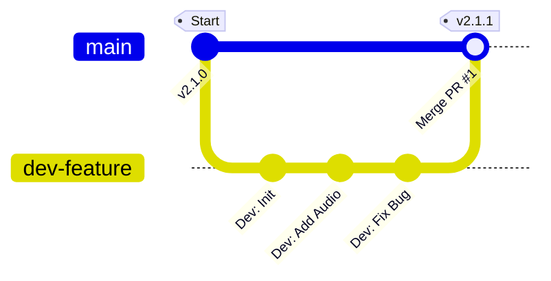

# Git 分支开发与合并流程图解

本文档为您展示标准的分支开发工作流。

## 1. 为什么 GitHub 显示 "No branches"？

如果您在 GitHub 上看到 *"This repository doesn’t have any branches"*，说明之前的 **推送 (Push) 操作失败了** 或者 **还在进行中**。

**常见原因**：
*   **网络卡顿**：连接 GitHub 超时。
*   **权限验证**：终端正在等待您输入 GitHub 账号密码（但你看不到提示）。
*   **空分支**：本地没有提交任何 Commit 就推送。

**解决方法**：
请在 VS Code 的终端中手动运行一次推送命令，查看具体报错：
```powershell
git push -u origin main
```

---

## 2. 分支开发流程图 (Workflow Diagram)

这是一个标准的团队协作开发流程。核心思想是：**main 分支永远保持干净稳定，所有新功能都在 dev 分支上开发。**



---

## 3. 详细操作步骤 (Cheatsheet)

### 阶段一：开始新工作 (Start)
假设你要开发一个“语音识别优化”功能。

1.  **确保主分支最新**:
    ```bash
    git checkout main
    git pull origin main
    ```
2.  **创建并切换分支**:
    ```bash
    # 格式: git checkout -b <分支名>
    git checkout -b dev-asr-optimization
    ```

### 阶段二：日常开发 (Loop)
在这个分支上，你可以随意修改代码，不用担心弄坏主程序。

1.  **写代码、编译测试**。
2.  **提交更改**:
    ```bash
    git add .
    git commit -m "优化了 VAD 阈值参数"
    ```
3.  **推送到远程** (每天下班前建议推一次，防止丢失):
    ```bash
    git push -u origin dev-asr-optimization
    ```

### 阶段三：合并代码 (Merge)
当功能开发完成并通过测试后：

1.  **不要在命令行直接合并** (为了保留审查记录)。
2.  **去 GitHub 网页端**：
    *   你会看到提示 *"dev-asr-optimization had recent pushes"*。
    *   点击绿色按钮 **"Compare & pull request"**。
3.  **填写描述**：告诉队友你改了什么。
4.  **点击 Create pull request**。

---

## 4. 合并标准 (Merge Standards)

作为项目管理者，您在点击 **"Merge pull request"** 按钮之前，需要检查以下标准：

| 检查项 | 标准说明 |
| :--- | :--- |
| **1. 编译通过** | 代码必须能在本地编译成功 (`idf.py build` 无报错)。 |
| **2. 功能验证** | 新功能按预期工作，且没有破坏原有功能 (Regression Test)。 |
| **3. 代码规范** | 没有多余的调试打印 (`printf`)，变量命名清晰，逻辑不混乱。 |
| **4. 无冲突** | GitHub 显示 *"This branch has no conflicts with the base branch"*。如有冲突需先解决。 |

> **通过标准后**：点击 **Squash and merge** (推荐) 或 **Merge commit**，将代码合并入 `main`。
