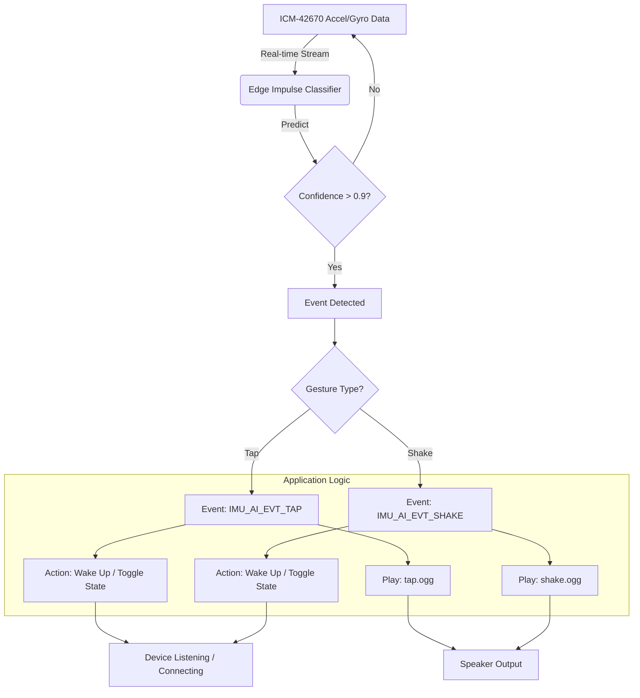

# IMU 姿态交互与本地语音反馈 (IMU Gesture & Local Voice)

## 1. 新增功能介绍 (Feature Introduction)
本次升级为小智 (ESP32-S3-BOX-3) 引入了基于 **IMU (惯性测量单元)** 的自然交互能力。设备现在能够感知用户的物理动作，并做出即时的语音反馈，**完全不需要连接服务器**。

*   **拍一拍 (Tap)**: 当用户轻轻拍打设备顶部或侧面时，设备会立即唤醒，并播放“别拍我”的语音。
*   **摇一摇 (Shake)**: 当用户摇晃设备时，设备会唤醒，并播放“别摇了”的警告音。

## 2. 使用指南 (Usage Guide)

### 触发条件
*   **状态要求**: 支持在 **待机 (Idle)**、**连接中 (Connecting)** 或 **聆听中 (Listening)** 状态下触发。
*   **唤醒逻辑**: 如果设备处于待机状态，拍击或摇晃会**直接唤醒设备**（相当于按下了 Boot 键），此时您可以直接对它说话。

### 操作演示
1.  **拍一拍**: 用手指轻敲屏幕上方边框或机身侧面。
    *   *反馈*: 设备亮屏/变色，播放语音 "别拍我" (`tap.ogg`)。
2.  **摇一摇**: 拿起设备左右摇晃。
    *   *反馈*: 设备亮屏/变色，播放语音 "别摇了" (`shake.ogg`)。

## 3. 技术实现 (Technology Stack)
本功能融合了嵌入式机器学习与本地音频渲染技术：

1.  **传感器**: **ICM-42670-P** (6轴惯性传感器: 加速度计 + 陀螺仪)。
2.  **AI 推理引擎**: **Edge Impulse (TinyML)**。
    *   我们采集了真实的设备运动数据，训练了一个轻量级神经网络分类器。
    *   模型运行在 ESP32 芯片本地，推理延迟 < 20ms。
3.  **本地音频引擎**: **Opus Codec**。
    *   使用嵌入式 OGG Opus 音频文件，直接从固件(`.rodata`)解码播放，无需网络或文件系统支持。

## 4. 语音反馈逻辑 (Voice Logic)

### 触发流程
代码检测到 AI 事件后，执行以下双重逻辑：

1.  **唤醒 (Wake Up)**: 调用 `app.ToggleChatState()`，让设备进入工作状态。
2.  **播放 (PlaySound)**: 调用 `app.PlaySound(Lang::Sounds::OGG_XXX)`。

### 音频文件
*   **Tap**: `main/assets/common/tap.ogg` (内容："被拍了，我在")
*   **Shake**: `main/assets/common/shake.ogg` (内容："现在车怎么有点晃，注意安全哦")

> **注意**: 这些音频文件被编译进固件 Binary 中，因此反应速度极快。

## 5. 逻辑框图 (Logic Diagram)

## 6. 其他升级要点 (Other Improvements)

除了可见的交互功能外，底层构建系统也进行了优化：

### 资源自动发现 (Asset Auto-Discovery)
*   **旧机制**: 每次添加新音频文件，都需要手动修改 `CMakeLists.txt` 和 `gen_lang.py`。
*   **新机制**: 
    *   `CMakeLists.txt` 现在自动扫描 `main/assets/common/*.ogg`。
    *   构建脚本会自动为 `common` 目录下的所有文件生成 `Lang::Sounds::OGG_FILENAME` 定义。
    *   **开发者福利**: 未来添加新音效，只需把 `.ogg` 文件扔进文件夹，运行 `idf.py reconfigure` 即可直接在代码中调用，无需修改一行构建脚本。
