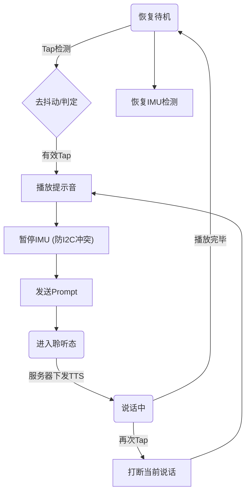

# IMU 动作交互与功能对齐文档 (IMU Gesture Interaction Guide)

## 1. 功能预期 (Functionality Expectation)

本功能旨在实现 **“基于动作的隐式交互 (Gesture-based Implicit Interaction)”**，让用户通过简单的物理动作与设备进行自然沟通。

*   **核心动作**: 用户轻轻拍打 (Tap) 设备机身。
*   **系统响应**:
    1.  **即时反馈**: 播放提示音（“叮”），确认动作已被识别。
    2.  **自动指令**: 设备自动向服务器发送预设文本：“*[系统事件：用户拍了拍你] 别拍了，我在！*”。
    3.  **拟人回复**: 服务器通过 TTS 语音回复（例如：“哎呀，你拍我干嘛？”）。
    4.  **循环闭环**: 回复播放完毕后，设备自动解除 IMU 暂停状态，允许立刻响应下一次 Tap。

---

## 2. 交互流程与状态机 (Interaction Flow)

### 状态流转图


### 关键状态说明
*   **Idle -> Listening**: 触发瞬间发生。此时 IMU 会被暂时暂停 (`SetPaused(true)`) 以防止抢占 I2C 总线。
*   **Listening -> Speaking**: 收到服务器的语音流后进入朗读状态。需确保此时**关闭唤醒词检测**以防止设备听到自己的声音而自我打断。
*   **Speaking -> Idle**: 朗读结束后，系统回到空闲。此时必须**自动恢复 IMU** (`SetPaused(false)`)，否则设备将对后续拍打无反应。

---

## 3. 技术故障复盘：I2C 问题 (I2C Fault Analysis)

在开发过程中，我们解决了两类核心 I2C 故障：

### A. 编译期冲突 (Driver Conflict)
*   **现象**: 编译报错 `CONFLICT! driver_ng is not allowed...`。
*   **原因**: ESP-IDF 驱动版本不兼容。
    *   **BSP (音频)**: 使用新版 I2C 驱动 (NG / `i2c_master.h`)。
    *   **Sensor Lib**: 使用旧版驱动 (Legacy / `i2c.h`)。
    *   **冲突点**: 同一个 I2C 端口无法同时承载两套驱动。
*   **解决**: 重写 IMU 驱动层，移除对旧版 `sensor_icm42607` 组件的依赖，直接使用 NG 接口操作寄存器。

### B. 运行时竞争 (Bus Contention / Race Condition)
*   **现象**: Tap 后无声，或系统重启。
*   **原因**: 总线繁忙。
    *   IMU 任务以 50Hz (20ms/次) 高频读取数据。
    *   Tap 触发时，主线程试图通过同一 I2C 总线配置音频 Codec (ES8311)。
    *   **结果**: 音频配置指令因总线被占而超时/失败，导致静音。
*   **解决**: 引入 **暂停机制 (Pause Mechanism)**。检测到 Tap 后立即暂停 IMU 采样，并在播放提示音前加入 `50ms` 缓冲延时。

---

## 4. 唤醒逻辑演进 (Evolution of Wake Logic)

### 旧版逻辑 (Legacy)
仅支持显式唤醒：
1.  **语音唤醒**: `AFE` 持续监听麦克风，匹配 "你好小智/小益" -> 触发 `WakeWordDetected`。
2.  **按键唤醒**: 按下 Boot 键 -> 物理中断 -> 发送 `StartListening`。

### 新版逻辑 (Current)
新增隐式意图唤醒：
*   **动作唤醒**: Tap 动作不仅唤醒设备，还**携带了语义**。它不仅是 "醒来"，还是 "如果不说话，就替我说一句话"。
*   **优势**: 省略了用户说唤醒词和指令的步骤，适合无声或快捷交互场景。

---

## 5. 协议与固定语音 (Protocol & Prompt)

### 通信协议
*   **传输层**: WebSocket / MQTT (基于 JSON)。
*   **消息格式**: 兼容现有协议：
    ```json
    {
      "type": "listen", 
      "text": "[System Event: User Tapped] 请回复：别拍了，我在！"
    }
    ```
    或者直接作为纯文本发送（取决于服务器实现）。这模拟了 STT (语音转文字) 的结果。

### 固定语音 (Prompt Injection)
*   我们不发送音频文件，而是发送一段 **Prompt (提示词)**。
*   **内容**: `[System Event: User Tapped] ...`
*   **目的**: 这是一段发给 LLM (大模型) 看的“剧本”。用自然语言告诉 AI 刚刚发生了什么物理事件，从而诱导 AI 做出符合语境的拟人化回复，而不是机械的 "我在"。

---
*文档生成时间: 2026-01-31*
