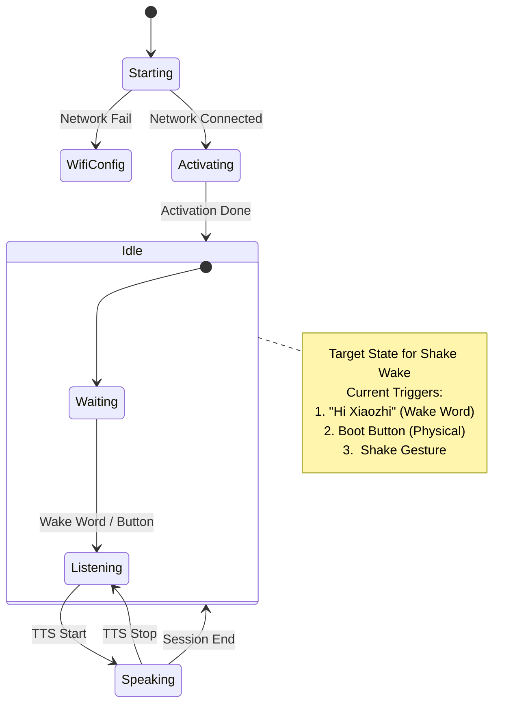

# IMU Wake-up Integration Analysis

This document analyzes the current application state machine and defines how to integrate the "Shake to Wake" functionality using the ICM42670 sensor.

## 1. Current State Machine (Simplified)

The system is event-driven (`application.cc` uses `xEventGroupWaitBits`). The core states are managed by `StateMachine`.



## 2. Integration Logic

To "plug in" the gesture recognition like a new faucet, we need to touch three points in the `Application` lifecycle.

### A. Initialization (Setup)
*   **Location**: `Application::Initialize()` in `application.cc`.
*   **Action**: Initialize the `ICM42670` driver and the Gesture Algorithm.
*   **Code**:
    ```cpp
    // application.cc
    auto& board = Board::GetInstance();
    auto imu = board.GetIMU(); // New method
    imu->Initialize();         // Start sensor
    ```

### B. Polling / Event Loop (Data Source)
*   **Location**: `clock_timer` callback (1-second tick is too slow) OR a new dedicated timer task.
*   **Recommendation**: Since gestures require high-frequency sampling (e.g., 50Hz or 100Hz), we cannot use the `1s` status bar timer.
*   **Action**: Create a new FreeRTOS polling task or high-frequency timer (e.g., 20ms).
*   **Code**:
    ```cpp
    // In new task or high-freq timer
    Gesture g = imu->DetectGesture();
    if (g == Gesture::SHAKE) {
        xEventGroupSetBits(event_group_, MAIN_EVENT_SHAKE_DETECTED);
    }
    ```

### C. State Transition (Logic Hook)
*   **Location**: `Application::Run()` loop.
*   **Action**: Handle the `MAIN_EVENT_SHAKE_DETECTED` bit.
*   **Logic**:
    ```cpp
    if (bits & MAIN_EVENT_SHAKE_DETECTED) {
        if (GetDeviceState() == kDeviceStateIdle) {
            ESP_LOGI(TAG, "Shake detected! Waking up...");
            audio_service_.PlaySound(Lang::Sounds::OGG_DING); // Audio Feedback
            SetDeviceState(kDeviceStateListening);            // Transition
            protocol_->SendText("{\"text\": \"(User Shook Device)\"}"); // Optional: Inform Server
        }
    }
    ```

## 3. Preparation for Porting (Step 2)

**Prerequisites**:
1.  **Driver**: Need the `icm42670.c/h` driver files.
2.  **Algorithm**: Need the `gesture.c/h` files (the "already developed" code).
3.  **Interface**: The code should expose a function like `int check_gesture(float acc_x, float acc_y, float acc_z)`.

**Next Step**: Please copy your developed gesture recognition code (Driver + Algo) into a folder (e.g., `main/imu/`) or paste it here so I can integrate it.
