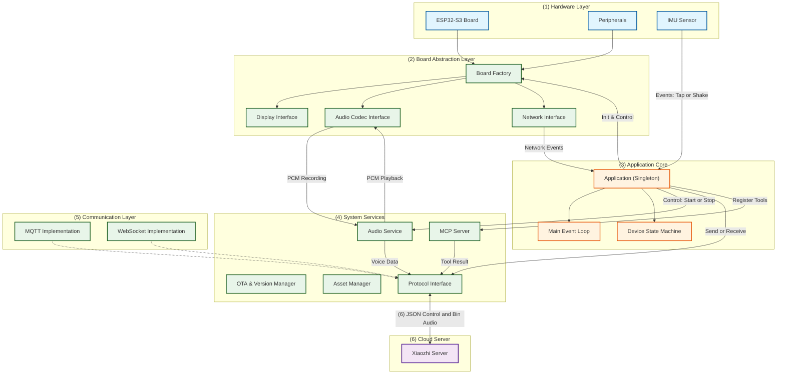

# System Architecture & Topology

## 1. System Topology Overview

The Xiaozhi ESP32 client is designed with a layered architecture, centering around a singleton `Application` controller that orchestrates data flow between the Hardware Abstraction Layer (HAL), Audio Services, and Network Protocols.

## 2. Core Modules Breakdown

### 2.1 Application Core (`main/application.cc`)
The `Application` class implements the Singleton pattern and serves as the central nervous system of the device.
- **Event Loop**: It maintains a FreeRTOS `EventGroup` to handle asynchronous events (Network, Audio, Buttons, IMU) in a non-blocking manner (`Application::Run`).
- **State Machine**: Manages logical states (Idle, Listening, Speaking, Connecting) via `DeviceStateMachine`, ensuring valid transitions.
- **Orchestration**: Directs the flow of data. For example, when the Wake Word is detected, it transitions the state to `Listening` and commands the `AudioService` to stream data to the `Protocol` layer.

### 2.2 Board Abstraction Layer (`main/boards/`)
To support the diverse range of hardware (ESP32-S3-BOX, generic dev kits, proprietary boards), the system uses a Factory Pattern.
- **`Board` Base Class**: Defines virtual methods for `GetDisplay()`, `GetAudioCodec()`, `GetNetwork()`, etc.
- **Concrete Implementations**:
  - `WifiBoard`: Standard WiFi-based boards.
  - `Ml307Board`: Cellular (4G) based boards.
- **Build System Integration**: `CMakeLists.txt` dynamically selects the implementation based on `CONFIG_BOARD_TYPE`.

### 2.3 Audio Service (`main/audio/`)
The `AudioService` handles the complex pipeline of voice interaction.
- **Dual-Task Architecture**:
  - **Input Task**: Captures raw PCM from `AudioCodec` -> Processors (AEC, AGC, VAD, NS) -> `Encoder` -> Protocol Send Queue.
  - **Output Task**: Protocol Decode Queue -> `Decoder` -> Resampler -> `AudioCodec` Playback.
- **Codecs**: Supports Opus for efficient network transmission.
- **Wake Word**: Runs a lightweight edge-inference model (ESP-SR or custom) to detect activation phrases ("Xiaozhi").

### 2.4 Communication Protocol (`main/protocols/`)
Abstracts the transport layer, supporting both MQTT and WebSocket.
- **Unified Interface**: `Protocol` class defines `SendAudio`, `SendText`, `OnIncomingAudio`, etc.
- **Data Encapsulation**:
  - **Control Plane**: JSON messages for state sync, TTS text, STT results, and MCP tool calls.
  - **Data Plane**: Binary Opus packets for real-time low-latency audio streaming.

### 2.5 MCP (Model Context Protocol) Server (`main/mcp_server.cc`)
Enables the AI agent to interact with the device's physical capabilities.
- **Tool Registration**: Modules register capabilities (e.g., "turn_on_light", "get_battery") as tools.
- **JSON Schema**: Generates tool definitions dynamically to send to the AI model.
- **Execution**: when the Server sends a tool call request, `McpServer` looks up the callback and executes it, returning the result.

### 2.6 IMU Gesture Intelligence (`components/imu_streamer/`)
Uses the 6-axis IMU (ICM-42670-P) for local interaction.
- **Gesture Detection**: Direct integration of motion algorithms to detect Tap and Shake events.
- **Event Injection**: Injects events into the main `Application` event loop to trigger Wake-up or Interrupt actions without network dependency.

## 3. Data Flow Example: "Voice Interaction"

1.  **Wake Up**:
    *   User says "Xiaozhi".
    *   `AudioService` detects Wake Word -> Signals `Application`.
    *   `Application` plays "Ding" sound -> Sets State to `Listening`.
2.  **Streaming**:
    *   `AudioService` starts encoding Mic data -> Pushes to Send Queue.
    *   `Application` creates `Protocol` packet -> Sends to Server.
3.  **Processing**:
    *   Server processes Audio -> Returns STT text (JSON).
    *   `Application` displays User text on Screen.
4.  **Response**:
    *   Server sends TTS start command + Audio Stream.
    *   `Protocol` receives Audio -> Pushes to Decode Queue.
    *   `AudioService` decodes -> Plays on Speaker.
5.  **Execution (Optional)**:
    *   If user asked "Turn on light", Server sends MCP JSON.
    *   `McpServer` executes generic GPIO tool -> Light turns on.
