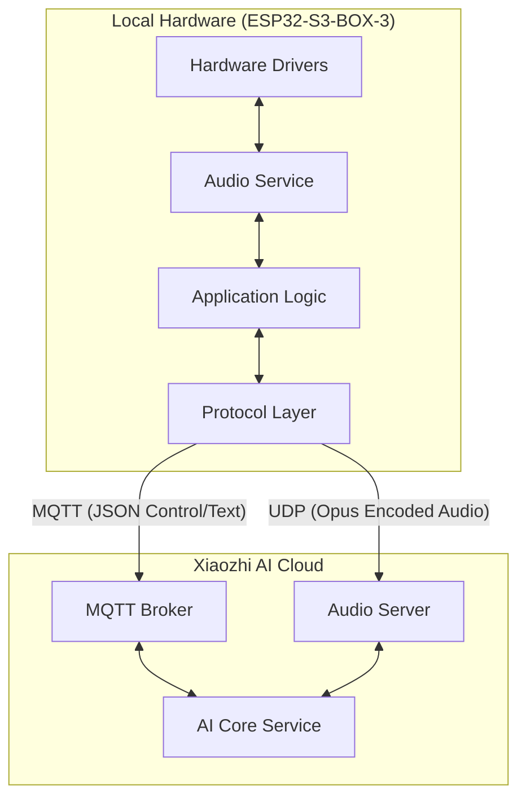
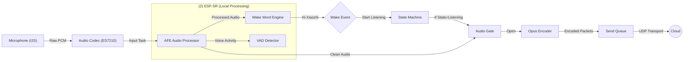
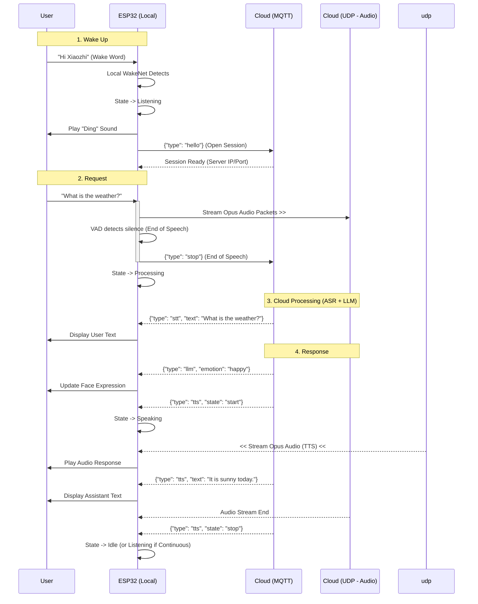

# Xiaozhi AI Interaction Architecture

This document illustrates the system architecture and interaction flow between the local ESP32-S3-BOX-3 hardware and the Xiaozhi AI Cloud.

## 1. High-Level System Overview

The system uses a hybrid protocol approach:
- **MQTT**: Used for control signaling, session management, and text data (STT/LLM responses).
- **UDP**: Used for real-time, low-latency, encrypted audio streaming (Upstream & Downstream).

## 2. Audio Pipeline & Wake Word Detection (Local)

This diagram details the local processing flow from microphone input to audio transmission. The **Wake Word Engine** runs locally on the ESP32 for low-latency activation.

## 3. Full Interaction Loop (Workflow)

This sequence diagram illustrates the lifecycle of a complete voice interaction: from waking up to receiving a response.

