# FreeRTOS 任务与状态机深度分析

本文档详细拆解了 `xiaozhi-esp32` 工程中的 FreeRTOS 任务架构与设备状态机流转逻辑。

## 1. FreeRTOS 任务全景分析

本工程采用多任务并发架构，主要任务可以分为 **核心业务类**、**外设驱动类** 和 **后台服务类**。

### 核心任务清单

| 任务名称 (Task Name) | 优先级 | 栈大小 | 核心绑定 | 职责描述 | 代码位置 (文件:行) |
| :--- | :---: | :---: | :---: | :--- | :--- |
| **Main** | 1 | 8K | Core 0 | 初始化系统、启动应用、运行主循环 (Application::VerifyLoop) | `main.cc:39` (隐式主任务) |
| **audio_input** | 8 | 6K | Core 0 | **音频采集**: 从 I2S 读取 PCM 数据，进行重采样、VAD 检测、唤醒词识别、推送到编码队列 | `audio_service.cc:91` |
| **audio_output** | 4 | 4K | 任意 | **音频播放**: 从解码队列取数据，进行重采样，写入 I2S 驱动播放声音 | `audio_service.cc:100` |
| **opus_codec** | 2 | 26K | 任意 | **音频编解码**: 负责 Opus 编码 (发送到云端) 和 Opus 解码 (来自云端)，是 CPU 密集型任务 | `audio_service.cc:128` |
| **encode_wake_word** | 2 | 28K | 任意 | **唤醒词上传**: 专门用于将检测到的唤醒词音频编码并上传云端 (短时任务) | `afe_wake_word.cc:185` |
| **event_task** | 5 | 4K | 任意 | **MQTT 网络事件**: 处理 MQTT 消息收发、心跳保活、网络重连逻辑 | `mqtt_protocol.cc:35` (IDF内部) |

### 外设与驱动任务

| 任务名称 | 优先级 | 栈大小 | 职责描述 | 备注 |
| :--- | :---: | :---: | :--- | :--- |
| **touch_daemon** / **tp** | 5 | 2-4K | **触摸与 GUI 交互**: 轮询触摸屏坐标，驱动 LVGL UI 刷新 | 各开发板 `board.cc` |
| **LedEvent** | ? | 2K | **LED 灯效**: 处理 LED 呼吸、闪烁等动画效果 | `gpio_led.cc:85` |
| **batt_mon_task** | 10 | 1K | **电量监控**: 定期读取电池电压，触发低电提醒 | `power_manager.cc:84` |
| **sscma** / **camera** | ? | ? | **视觉处理**: (若启用) 摄像头数据采集与模型推理 | `sscma_camera.cc` |

---

## 2. 设备状态机 (DeviceStateMachine)

设备状态机是整个应用的大脑，管理着语音交互的生命周期。

### 状态定义
所有状态定义在 `DeviceState` 枚举中：


### 状态流转图 (State Transition Diagram)

以下是根据代码 `device_state_machine.cc` 中的 `IsValidTransition` 函数绘制的严谨状态流转图：

```mermaid
stateDiagram-v2
    [*] --> Unknown
    Unknown --> Starting
    
    Starting --> WifiConfiguring: 需配网/按键触发
    Starting --> Activating: 已配网

    WifiConfiguring --> Activating: 配网成功
    WifiConfiguring --> AudioTesting: 进入测试
    AudioTesting --> WifiConfiguring

    Activating --> Idle: 激活成功
    Activating --> Upgrading: 发现新固件
    Activating --> WifiConfiguring: 激活失败

    Upgrading --> Activating: 升级成功/重启
    Upgrading --> Idle: 升级失败

    Idle --> Connecting: 按键/唤醒/摇一摇
    Idle --> Listening: 连续对话模式
    Idle --> Speaking: 系统播报
    Idle --> Activating: 重新激活
    Idle --> Upgrading: 收到升级指令
    Idle --> WifiConfiguring: 强制重配

    Connecting --> Listening: 会话建立成功
    Connecting --> Idle: 连接失败/取消

    Listening --> Speaking: VAD检测结束/识别完成
    Listening --> Idle: 超时/VAD静音

    Speaking --> Listening: 连续对话
    Speaking --> Idle: 回复结束

    FatalError --> [*]
```



## 3. 关键状态转换条件详解

以下表格列出了核心状态转换的**触发条件 (Trigger)** 与 **代码依据**：

| 源状态 | 目标状态 | 触发条件 | 代码位置 |
| :--- | :--- | :--- | :--- |
| **Idle** | **Connecting** | 1. 唤醒词 "Hi Xiaozhi" 被检测到<br>2. 按下 Boot 键 (ToggleChatState)<br>3. 摇一摇手势 | `Application::HandleWakeWordDetected`<br>`Application::HandleToggleChatEvent` |
| **Connecting** | **Listening** | Cloud 确认 Session 建立，分配了 UDP 端口，准备好接收音频 | `MqttProtocol::OnAudioChannelOpened` -> `Application::SetDeviceState(Listening)` |
| **Listening** | **Speaking** | 1. 用户停止说话 (VAD Silence检测)<br>2. 收到 Cloud 下发的 TTS "start" 指令 | `AudioService::OnVadStateChange` (Report)<br>`Application::OnIncomingJson` (type:tts, state:start) |
| **Speaking** | **Idle** | TT S播放完毕 (收到 Cloud "stop" 指令) 且**不在**连续对话模式 | `Application::OnIncomingJson` (type:tts, state:stop) |
| **Speaking** | **Listening** | TTS 播放完毕，且 SDK 配置为 **连续对话模式** (ListeningMode::AutoStop) | 同上，逻辑分支判断 |
| **Starting** | **WifiConfiguring** | NVS 中没有已保存的 WiFi 信息，或启动时检测到重置操作 | `WifiBoard::TryWifiConnect` 失败后自动进入 |
| **Activating** | **Upgrading** | 启动阶段检查到 `version.json` 中有比当前版本更高的固件 | `Application::CheckNewVersion` -> `ota_->HasNewVersion()` |

### 核心转换逻辑代码片段 (Application.cc)

```cpp
// 收到 TTS 停止指令时的状态判断
} else if (strcmp(state->valuestring, "stop") == 0) {
    Schedule([this]() {
      if (GetDeviceState() == kDeviceStateSpeaking) {
        if (listening_mode_ == kListeningModeManualStop) {
          SetDeviceState(kDeviceStateIdle); // 手动模式回空闲
        } else {
          SetDeviceState(kDeviceStateListening); // 自动模式回聆听 (连续对话)
        }
      }
    });
}
```
